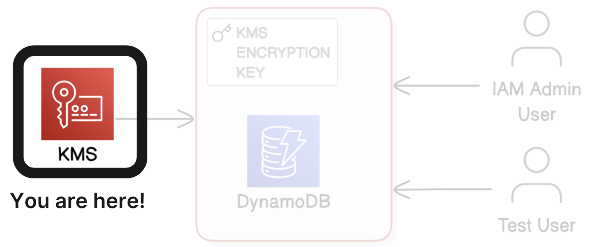
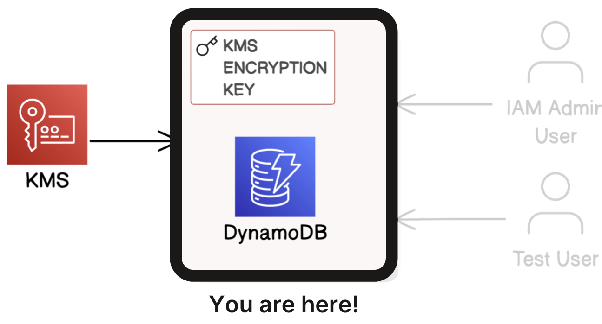
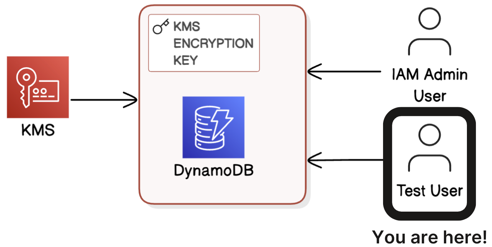
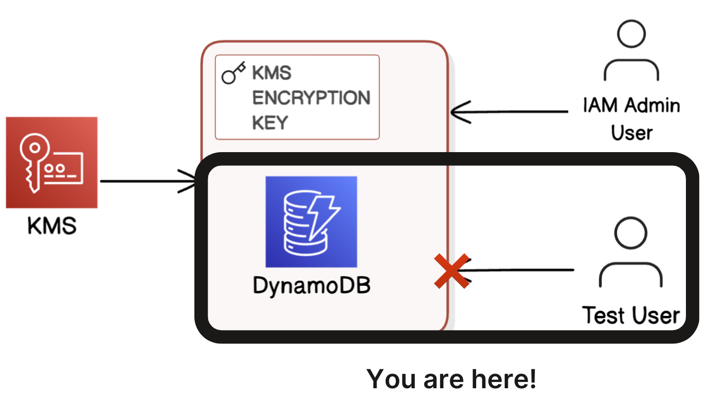
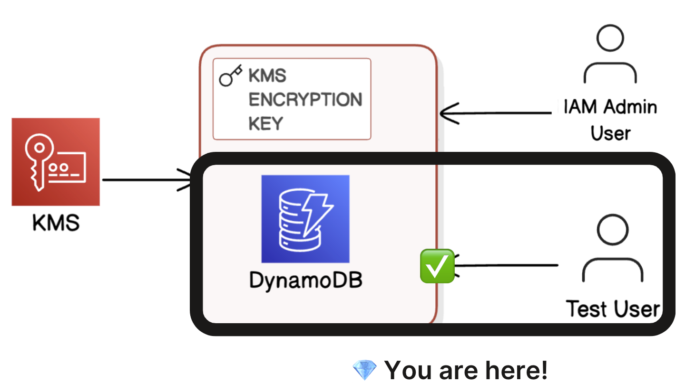
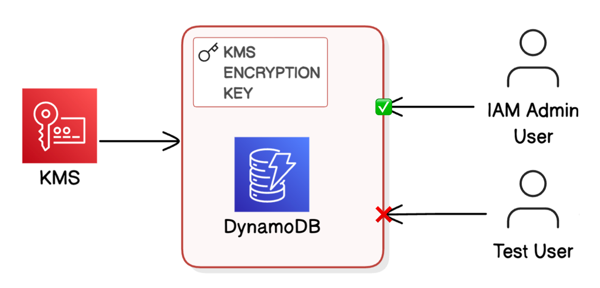

# Encrypting DynamoDB Data with AWS KMS 🔑
Secure Data Encryption • IAM Access Control • Key Policy Management

---

## Project Description
This project demonstrates how to **encrypt a DynamoDB table using a customer‑managed AWS KMS key** and verify that decryption access is properly enforced through IAM permissions and KMS key policies.

Instead of simply enabling encryption, the project focuses on:

- **How AWS KMS handles decryption access**
- **How unauthorized users are blocked**
- **How key policies determine who can read encrypted data**

To make the workflow clear and practical, the project includes:

- **Creating a symmetric KMS key** to encrypt DynamoDB data  
- **Applying the key to a DynamoDB table** to enable encryption at rest  
- **Adding data** and observing how DynamoDB decrypts it for authorized users  
- **Creating a test IAM user** with DynamoDB access but *no* KMS permissions  
- **Testing access** to show how AWS blocks decryption without key permissions  
- **Updating the KMS key policy** to grant controlled decrypt access  
- **Re‑testing access** to confirm the policy change works  

Overall, this project demonstrates how AWS KMS, DynamoDB, and IAM work together to secure data, enforce least‑privilege access, and protect encrypted resources at the key level.

---

## Technologies Used
- **AWS KMS** — Customer‑managed keys for encryption and decryption  
- **AWS DynamoDB** — Encrypted NoSQL database  
- **AWS IAM** — Users, roles, and permission boundaries  
- **AWS Console & AWS CLI** — Resource creation and testing  
- **JSON Key Policies** — Fine‑grained access control  
- **Git & GitHub** — Version control and documentation  

---

## Architecture Overview
This project uses a **customer‑managed KMS key** to encrypt a DynamoDB table. IAM permissions alone are not enough to decrypt data—AWS KMS must explicitly allow the user to perform decryption.

### Key Components
- **KMS CMK** — Performs encryption and decryption  
- **DynamoDB Table** — Encrypted at rest using the CMK  
- **Admin User** — Full permissions to manage KMS and DynamoDB  
- **Test User** — DynamoDB access only (no KMS permissions)  
- **KMS Key Policy** — Controls who can decrypt the data  

### High‑Level Flow
1. Admin creates a CMK in KMS
2. Admin creates a DynamoDB table encrypted with the CMK  
3. Admin inserts data  
4. Test user attempts to read data → **fails**  
5. Admin updates the key policy  
6. Test user attempts again → **succeeds**  

---

## Workflow Diagrams

**Part 1:** Creating the encryption key and adding admins and users.  


**Part 2:** Creating the DynamoDB table and encrypting it with KMS.  


**Part 3:** Creating the test user and giving full access only to DynamoDB.  


**Part 4:** Failing to view the table as the test user.  


**Part 5:** Modifying the key policy and granting the test user decrypt permissions.  


**Part 6:** Final diagram showing the complete project workflow.  


---

## Example KMS Key Policy Snippet
This policy grants the test user permission to decrypt data encrypted with the CMK.

```json
{
  "Effect": "Allow",
  "Principal": {
    "AWS": "arn:aws:iam::<ACCOUNT-ID>:user/TestUser"
  },
  "Action": [
    "kms:Decrypt",
    "kms:DescribeKey"
  ],
  "Resource": "*"
}